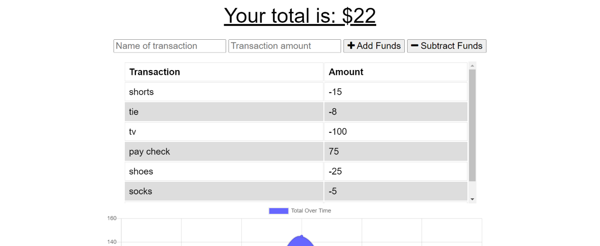
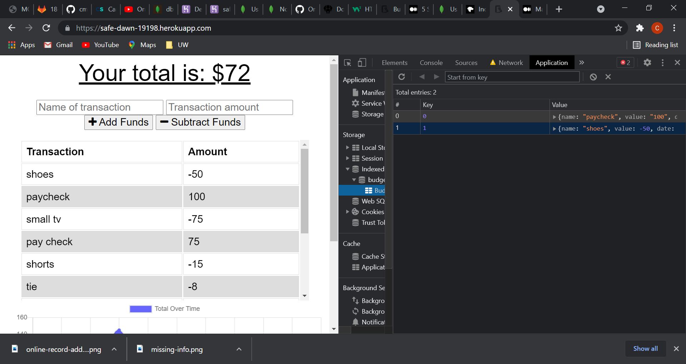
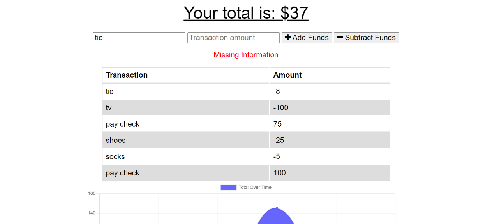

# Online-Offline-Budget-Trackers

## Description:
An App that allows users to keep track of their budget when online and offline.

## Repository
[Application Repository URL](https://github.com/cmcunningham27/Online-Offline-Budget-Trackers)

## Table of contents
* [Project's-aim](#project's-aim)
* [How-to-use](#how-to-use)
* [Link-to-deployed-application](#link-to-deployed-application)
* [Technologies](#technologies)
* [Contributors](#contributors)
* [Challenges](#Challenges)
* [License](#license)
* [Questions](#questions)

## Project's aim
To allow users the ability to keep track of their withdrawals and deposits in their account whether they are online or offline. This is done with the use of manifest, service-worker, and indexedDB.

## How to use
When online or offline you will enter a name for your deposit or withdrawal where it says "Name of transaction". Then, you will need to enter the amount for that transaction where it says "Transaction Amount". Otherwise, it will tell you there is missing information. If the transaction is a deposit then you will click "+ Add Funds", if it is a withdrawal click "- Subtract Funds". You will see the change in your balance from the current and past transactions below the table of all transactions made. At the very top you will see your remaing budget displayed for you. If you were offline and return to being online, all the data that was saved when offline are now saved into the app's original mongoDB.

- Important part of being offline... if you are looking at you indexedDB's object store called BudgetStore, you may find that your individual records are not being displayed. To fix this issue, go back to the database "budget" in the indexedDB and click the button that says "Refresh Database". Return to the BudgetStore and you will find all records are now displayed. 

## Link to deployed application:
[Budget Tracker](https://safe-dawn-19198.herokuapp.com)

## Technologies
Project is created with:

* CSS 
* Javascript
* HTML
* Express.js
* Mongoose
* MongoDB
* IndexedDB
* Manifest
* Service-worker

## Contributors:
* [Cassandra-Cunningham](https://github.com/cmcunningham27)

## Challenges
- To start off with, I wasn't quite confident in my knowledge of indexedDB and it's purpose in this activity. I made sure I gained that understanding before beginning the indexedDB. This proved helpful, as I did not realize, until then, that the indexed DB would be sending its stored data to the app's mongoDB once back online. 
- I ran into a problem when trying to add a new record to the store in the indexedDB. It kept telling me that indexedDB does not generate its own keys. To fix this I changed .add to .put, declared and assigned a counter variable which was then added as the second parameter in the .put() as an increment with ++. This removed the error and was adding each record to the end of the store's array.
- At one point I thought I was doing something wrong because the new records I was creating while offline were not displaying in the indexedDB's object store. However, they were being sent to and stored in the mongoDB when I went back online. Trying to understand what I was missing proved to be an issue with indexedDB. If I entered new records and then went to the database in indexedDB, clicked "Refresh Database" I would then ALL the offline records displayed.

## License
This project is licensed under the MIT license.

## Questions
[E-mail](mailto:sttepstutoring@yahoo.com)

E-mailing me is the best option